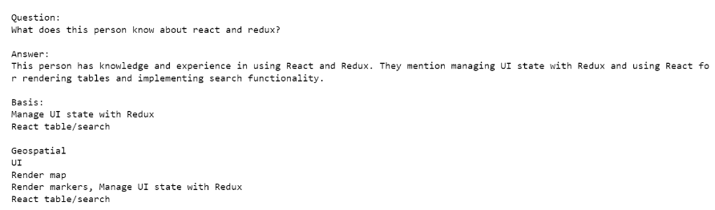
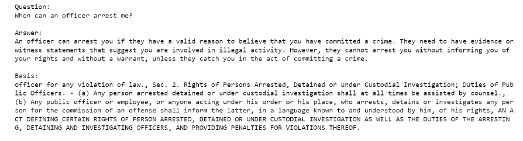
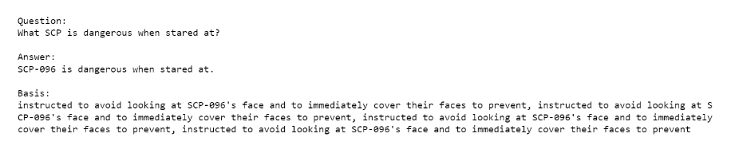

# Setup:
1. python3 -m venv venv
2. source venv/bin/activate
3. pip install -r requirements.txt
4. setup a `.env` file based o the `.env_template` file
5. jupyter notebook
6. open `LLM APP.ipynb` and follow the steps in the first few cells

# Samples:
1. 
2. 
3. 
